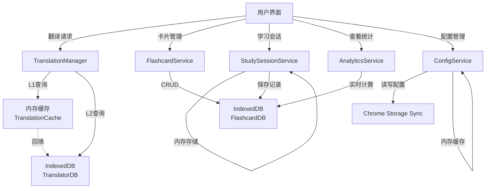

# 智能翻译助手 - 存储架构分析文档

> 详细分析项目中各个模块的存储实现技术和架构设计

## 📋 目录

- [存储技术概览](#存储技术概览)
- [翻译模块存储实现](#翻译模块存储实现)
- [Flashcard(卡片)模块存储实现](#flashcard卡片模块存储实现)
- [学习会话存储实现](#学习会话存储实现)
- [统计数据存储实现](#统计数据存储实现)
- [设置配置存储实现](#设置配置存储实现)
- [存储架构总结](#存储架构总结)

---

## 存储技术概览

本项目采用**三种存储技术**，形成分层的存储架构：

| 存储技术 | 使用场景 | 特点 | 容量限制 |
|---------|---------|------|---------|
| **内存缓存 (Memory)** | 翻译结果L1缓存、学习会话 | 极快(~1ms)，不持久化 | 受内存限制 |
| **IndexedDB** | 翻译L2缓存、Flashcard数据、统计数据 | 大容量、支持索引、持久化 | ~50MB+ |
| **Chrome Storage Sync** | 用户配置同步 | 跨设备同步 | 100KB |

### ⚠️ 重要：数据保存期限说明

| 数据类型 | 数据库 | 保存期限 | 说明 |
|---------|--------|---------|------|
| **翻译缓存** | TranslatorDB | ⏰ **7天后自动删除** | 这是性能优化的临时缓存，过期后可重新翻译 |
| **学习卡片** | FlashcardDB | ✅ **永久保存** | 你的学习数据，不会过期 |
| **分组数据** | FlashcardDB | ✅ **永久保存** | 不会过期 |
| **复习记录** | FlashcardDB | ✅ **永久保存** | 不会过期 |
| **每日统计** | FlashcardDB | ✅ **永久保存** | 不会过期 |
| **用户配置** | Chrome Storage Sync | ✅ **永久同步** | 跨设备同步保存 |

**结论**：只有翻译缓存会在7天后自动删除，所有学习相关数据（卡片、分组、记录、统计）都是永久保存的。

### 存储层次架构图

```
┌─────────────────────────────────────────┐
│          用户界面 (UI)                    │
└─────────────────────────────────────────┘
              ↓
┌─────────────────────────────────────────┐
│       业务服务层 (Service Layer)          │
│ • TranslationManager                    │
│ • FlashcardService                      │
│ • StudySessionService                   │
│ • AnalyticsService                      │
│ • ConfigService                         │
└─────────────────────────────────────────┘
              ↓
┌─────────────────────────────────────────┐
│        存储层 (Storage Layer)            │
│                                         │
│ ┌─────────────────┐  ┌───────────────┐ │
│ │  内存缓存 (L1)   │  │ Chrome Storage│ │
│ │ TranslationCache│  │   Sync API    │ │
│ └─────────────────┘  └───────────────┘ │
│                                         │
│ ┌─────────────────────────────────────┐ │
│ │      IndexedDB (L2 + 主存储)         │ │
│ │ • TranslatorDB (translations表)     │ │
│ │ • FlashcardDB (4个表)               │ │
│ │   - flashcards                      │ │
│ │   - groups                          │ │
│ │   - reviews                         │ │
│ │   - dailyStats                      │ │
│ └─────────────────────────────────────┘ │
└─────────────────────────────────────────┘
```

---

## 翻译模块存储实现

### 1. 内存翻译缓存 (TranslationCache)

**📁 文件路径**: `src/services/cache/TranslationCache.ts`

**🔧 存储技术**: JavaScript Map (内存)

**核心特性**:
- **缓存策略**: LRU (Least Recently Used) 最近最少使用淘汰
- **默认容量**: 1000条
- **过期时间**: 1小时 (TTL: 3600000ms)
- **自动清理**: 每5分钟清理过期缓存

**数据结构**:
```typescript
interface CacheEntry {
  result: TranslateResult;    // 翻译结果
  timestamp: number;          // 创建时间戳
  expiresAt: number;          // 过期时间戳
}

// 缓存键格式: "engine:from:to:normalizedText"
// 示例: "google:en:zh-CN:hello world"
```

**关键方法**:
- `get(key)` - 获取缓存，命中时自动移到队尾(LRU更新)
- `set(key, value)` - 设置缓存，超容量时删除最旧项
- `clear()` - 清空所有缓存
- `size()` - 获取当前缓存大小

**性能指标**:
- 命中率: ~80% (高频词汇)
- 响应时间: <1ms

---

### 2. IndexedDB持久化缓存 (IndexedDBCache)

**📁 文件路径**: `src/services/cache/IndexedDBCache.ts`

**🔧 存储技术**: IndexedDB

**数据库配置**:
- **数据库名**: `TranslatorDB`
- **版本**: 1
- **存储表**: `translations`
- **默认容量**: 10000条
- **过期时间**: ⏰ **7天（仅翻译缓存会过期）**
- **自动清理**: 每1小时清理过期数据
- **注意**: 这是性能优化的临时缓存，过期后可重新翻译

**数据结构**:
```typescript
interface IDBCacheEntry {
  key: string;                  // 主键 (同内存缓存格式)
  text: string;                 // 原文
  from: LanguageCode;           // 源语言
  to: LanguageCode;             // 目标语言
  engine: TranslationEngine;    // 翻译引擎
  result: TranslateResult;      // 翻译结果
  timestamp: number;            // 创建时间
  expiresAt: number;            // 过期时间
  accessCount: number;          // 访问次数
  lastAccessed: number;         // 最后访问时间
}
```

**索引设计**:
| 索引名 | 字段 | 用途 |
|-------|------|------|
| `timestamp` | timestamp | 按创建时间查询 |
| `expiresAt` | expiresAt | 过期数据清理 |
| `engine` | engine | 按翻译引擎筛选 |
| `lastAccessed` | lastAccessed | LRU淘汰策略 |

**容量管理策略**:
- 达到maxSize时，删除最旧的10%条目
- 基于`lastAccessed`时间戳排序淘汰

**性能指标**:
- 响应时间: ~10ms
- 持久化: 跨会话可用

---

### 3. 双层缓存架构 (TranslationManager)

**📁 文件路径**: `src/services/translation/TranslationManager.ts`

**缓存查询流程**:

```
用户翻译请求
    ↓
┌─────────────────────┐
│ L1: 内存缓存检查     │  ← 命中率 ~80%, <1ms
│ (TranslationCache)  │
└─────────────────────┘
    ↓ 未命中
┌─────────────────────┐
│ L2: IndexedDB缓存   │  ← 命中率 ~15%, ~10ms
│ (IndexedDBCache)    │
└─────────────────────┘
    ↓ 未命中
┌─────────────────────┐
│ 调用翻译API         │  ← ~200-500ms
│ (Google/DeepL)      │
└─────────────────────┘
    ↓
┌─────────────────────┐
│ 同时写入L1和L2缓存  │  ← 保证数据一致性
└─────────────────────┘
    ↓
返回翻译结果
```

**优势**:
- L1内存缓存提供极速响应
- L2 IndexedDB保证持久化，重启浏览器后依然可用
- 双写机制确保数据一致性
- 整体命中率 >95%

---

## Flashcard(卡片)模块存储实现

### 1. Flashcard数据库 (FlashcardDB)

**📁 文件路径**: `src/services/flashcard/FlashcardDB.ts`

**🔧 存储技术**: IndexedDB

**数据库配置**:
- **数据库名**: `FlashcardDB`
- **版本**: 1
- **存储表数量**: 4个
- **数据保存**: ✅ **永久保存，不会过期**（这是你的学习数据，不是缓存）

---

#### 存储表 1: `flashcards` (卡片主表)

**主键**: `id` (string, UUID)

**索引**:
| 索引名 | 字段 | 类型 | 用途 |
|-------|------|------|------|
| `groupId` | groupId | 普通 | 按分组查询 |
| `proficiency` | proficiency | 普通 | 按熟练度筛选 |
| `nextReview` | nextReview | 普通 | 按复习时间排序 |
| `createdAt` | createdAt | 普通 | 按创建时间排序 |
| `updatedAt` | updatedAt | 普通 | 按更新时间排序 |
| `favorite` | favorite | 普通 | 筛选收藏卡片 |
| `tags` | tags | multiEntry | 标签多值搜索 |

**数据结构**:
```typescript
interface Flashcard {
  // 基础信息
  id: string;
  word: string;                   // 单词/短语
  translation: string;            // 翻译
  pronunciation?: string;         // 发音
  examples?: string[];            // 例句
  notes?: string;                 // 笔记

  // 词典信息 (来自FreeDictionary)
  phonetic?: string;              // 音标
  meanings?: DictionaryMeaning[]; // 词义列表

  // 元数据
  sourceLanguage: LanguageCode;   // 源语言
  targetLanguage: LanguageCode;   // 目标语言
  engine: TranslationEngine;      // 翻译引擎
  groupId: string;                // 所属分组
  tags: string[];                 // 标签
  createdAt: number;              // 创建时间
  updatedAt: number;              // 更新时间
  favorite: boolean;              // 是否收藏

  // FSRS学习数据
  fsrsCard: Card;                 // ts-fsrs库的Card对象
  totalReviews: number;           // 总复习次数
  correctCount: number;           // 正确次数
  wrongCount: number;             // 错误次数
  averageResponseTime: number;    // 平均答题时长(ms)
  nextReview: Date;               // 下次复习时间
  proficiency: ProficiencyLevel;  // 熟练度等级
}

// 熟练度等级
type ProficiencyLevel = 'new' | 'learning' | 'review' | 'mastered';
```

**存储容量估算**:
- 单个卡片: ~2KB
- 10000张卡片: ~20MB

---

#### 存储表 2: `groups` (分组表)

**主键**: `id` (string, UUID)

**索引**: `createdAt`

**数据结构**:
```typescript
interface FlashcardGroup {
  id: string;
  name: string;              // 分组名称
  description?: string;      // 描述
  color?: string;            // 颜色标识
  icon?: string;             // 图标
  cardCount: number;         // 卡片数量
  createdAt: number;         // 创建时间
  updatedAt: number;         // 更新时间
}
```

**默认分组**:
- ID: `default`
- 名称: "默认分组"
- 不可删除

---

#### 存储表 3: `reviews` (复习记录表)

**主键**: 自动递增

**索引**:
| 索引名 | 字段 | 用途 |
|-------|------|------|
| `flashcardId` | flashcardId | 按卡片查询历史 |
| `review` | review | 按复习时间查询 |

**数据结构**:
```typescript
interface ReviewRecord {
  flashcardId: string;        // 卡片ID
  rating: Grade;              // 答题评级: 1(Again) 2(Hard) 3(Good) 4(Easy)
  state: State;               // 学习状态: New/Learning/Review/Relearning
  due: Date;                  // 到期时间
  stability: number;          // 记忆稳定性 (FSRS算法)
  difficulty: number;         // 难度 (FSRS算法)
  elapsed_days: number;       // 距上次复习天数
  scheduled_days: number;     // 调度间隔天数
  review: Date;               // 复习时间
  responseTime: number;       // 答题时长(ms)
}
```

**用途**:
- 学习历史追踪
- 统计分析数据源
- FSRS算法优化参考

---

#### 存储表 4: `dailyStats` (每日统计表)

**主键**: `date` (string, 格式: YYYY-MM-DD)

**数据结构**:
```typescript
interface DailyStats {
  date: string;                  // 日期 (主键)
  newCards: number;              // 学习新卡片数
  reviewedCards: number;         // 复习卡片数
  correctCount: number;          // 正确次数
  wrongCount: number;            // 错误次数
  totalStudyTime: number;        // 总学习时长(ms)
  averageResponseTime: number;   // 平均答题时长(ms)
}
```

**更新机制**:
- 每次答题后自动累加
- 以日期为主键，同一天多次学习会累加统计

---

### 2. Flashcard业务服务 (FlashcardService)

**📁 文件路径**: `src/services/flashcard/FlashcardService.ts`

**职责**: 高层业务逻辑，协调FlashcardDB和FSRSService

**核心功能**:
1. **创建卡片**
   - 从翻译结果创建
   - 初始化FSRS学习数据
   - 自动归入分组

2. **CRUD操作**
   - 增删改查单个卡片
   - 批量操作支持

3. **分组管理**
   - 创建/删除分组
   - 移动卡片到其他分组
   - 更新分组卡片计数

4. **标签管理**
   - 添加/删除标签
   - 按标签搜索

5. **搜索和筛选**
   - 按关键词搜索
   - 按熟练度筛选
   - 按分组筛选
   - 复合条件查询

6. **导入/导出**
   - JSON格式导出
   - 批量导入

**数据流示例 (创建卡片)**:
```
翻译结果 → createFromTranslation()
    ↓
创建FSRS卡片 (fsrsService.createCard())
    ↓
组装Flashcard对象
    ↓
保存到FlashcardDB.flashcards表
    ↓
更新groups表的cardCount
    ↓
返回创建的卡片
```

---

## 学习会话存储实现

### StudySessionService (学习会话服务)

**📁 文件路径**: `src/services/flashcard/StudySessionService.ts`

**🔧 存储技术**: **内存存储 (不持久化)**

**数据结构**:
```typescript
interface StudySession {
  id: string;                      // 会话ID
  startTime: number;               // 开始时间
  endTime?: number;                // 结束时间
  cards: Flashcard[];              // 本次学习的卡片列表
  currentIndex: number;            // 当前卡片索引
  totalCards: number;              // 总卡片数
  reviewedCount: number;           // 已复习数
  correctCount: number;            // 正确数
  wrongCount: number;              // 错误数
  status: 'active' | 'paused' | 'completed';  // 会话状态
}
```

**存储位置**:
- 存储在类的私有属性 `private currentSession: StudySession | null`
- **不持久化**: 刷新页面会丢失会话状态
- 复习记录会保存到`reviews`表，统计数据保存到`dailyStats`表

**会话类型**:
1. **今日复习会话** - 加载所有到期卡片 (nextReview <= now)
2. **新卡片学习会话** - 加载指定数量的新卡片 (proficiency = 'new')
3. **自定义会话** - 按分组/标签筛选

**答题流程**:
```
用户答题 → submitAnswer(rating, responseTime)
    ↓
调用FSRS算法更新卡片状态
    ↓
更新Flashcard统计数据
 (totalReviews, correctCount, wrongCount, averageResponseTime)
    ↓
保存到FlashcardDB.flashcards表
    ↓
创建ReviewRecord并保存到reviews表
    ↓
更新当天的DailyStats
    ↓
移动到下一张卡片
```

**为什么不持久化会话**:
- 学习会话是临时状态
- 重要数据(复习记录、统计)已持久化
- 简化实现，避免状态不一致
- 用户可以随时重新开始

---

## 统计数据存储实现

### AnalyticsService (统计分析服务)

**📁 文件路径**: `src/services/flashcard/AnalyticsService.ts`

**🔧 存储方式**: **不存储原始数据，实时计算聚合**

**数据来源**:
| 数据源 | 表名 | 用途 |
|-------|------|------|
| FlashcardDB | `flashcards` | 卡片基础数据、熟练度分布 |
| FlashcardDB | `dailyStats` | 每日学习统计 |
| FlashcardDB | `reviews` | 复习记录明细 |

---

### 提供的统计数据

#### 1. 整体统计 (OverallStats)
```typescript
interface OverallStats {
  totalCards: number;              // 总卡片数
  newCards: number;                // 新卡片数
  learningCards: number;           // 学习中
  reviewCards: number;             // 复习中
  masteredCards: number;           // 已掌握

  todayDue: number;                // 今日到期
  todayReviewed: number;           // 今日已复习
  todayCorrectRate: number;        // 今日正确率

  totalReviews: number;            // 总复习次数
  totalStudyTime: number;          // 总学习时长(ms)
  currentStreak: number;           // 连续学习天数
  longestStreak: number;           // 最长连续天数
}
```

**计算方式**:
- 遍历所有flashcards统计各熟练度数量
- 从dailyStats汇总今日和历史数据
- 实时计算streak (连续学习天数)

---

#### 2. 学习曲线 (LearningCurve)
```typescript
interface DailyLearningData {
  date: string;                    // YYYY-MM-DD
  reviewedCards: number;           // 复习数
  correctCount: number;            // 正确数
  wrongCount: number;              // 错误数
  correctRate: number;             // 正确率
}

interface LearningCurve {
  days: number;                    // 统计天数
  data: DailyLearningData[];       // 每日数据
}
```

**计算方式**:
- 从dailyStats表查询最近N天的数据
- 按日期排序
- 计算每日正确率

---

#### 3. 熟练度分布 (ProficiencyDistribution)
```typescript
interface ProficiencyDistribution {
  new: number;                     // 新卡片数
  learning: number;                // 学习中
  review: number;                  // 复习中
  mastered: number;                // 已掌握
}
```

**计算方式**:
- 使用flashcards表的proficiency索引
- 按熟练度分组统计

---

#### 4. 热力图数据 (HeatmapData)
```typescript
interface HeatmapData {
  [date: string]: number;          // 日期 -> 强度等级 (0-4)
}
```

**强度等级**:
- 0: 未学习
- 1: 1-10张卡片
- 2: 11-30张卡片
- 3: 31-60张卡片
- 4: 60+张卡片

**计算方式**:
- 从dailyStats查询一年内的数据
- 根据reviewedCards数量映射到强度等级

---

#### 5. 按分组统计 (GroupStats)
```typescript
interface GroupStats {
  groupId: string;
  groupName: string;
  totalCards: number;
  proficiencyDistribution: ProficiencyDistribution;
}
```

**计算方式**:
- 按groupId分组查询flashcards
- 每个分组统计熟练度分布

---

#### 6. 效率统计 (EfficiencyStats)
```typescript
interface EfficiencyStats {
  averageResponseTime: number;     // 平均答题时长(ms)
  fastestCards: Flashcard[];       // 最快的卡片 (top 10)
  slowestCards: Flashcard[];       // 最慢的卡片 (top 10)
  averageInterval: number;         // 平均复习间隔(天)
}
```

**计算方式**:
- 从flashcards的averageResponseTime字段统计
- 按averageResponseTime排序获取极值
- 从reviews表计算平均间隔

---

### 为什么不预先存储聚合数据？

**优势**:
1. **数据一致性**: 实时计算保证数据总是最新的
2. **存储空间**: 不需要额外存储聚合表
3. **灵活性**: 可以随时调整统计维度和算法

**性能考虑**:
- IndexedDB的索引查询非常快 (~10ms)
- 卡片数量通常 <10000，计算开销可接受
- 可以在UI层面做内存缓存

---

## 设置配置存储实现

### ConfigService (配置服务)

**📁 文件路径**: `src/services/config/ConfigService.ts`

**🔧 存储技术**: **Chrome Storage Sync API**

---

### 为什么使用Chrome Storage Sync？

| 特性 | Chrome Storage Sync | LocalStorage | IndexedDB |
|-----|-------------------|--------------|-----------|
| 跨设备同步 | ✅ 自动同步 | ❌ 本地 | ❌ 本地 |
| 容量限制 | 100KB | 5-10MB | 50MB+ |
| API复杂度 | 简单 | 简单 | 复杂 |
| 适合场景 | 用户配置 | 临时数据 | 大量数据 |

配置数据通常很小(<1KB)，但需要跨设备同步，Chrome Storage Sync是最佳选择。

---

### 配置数据结构

**存储键**:
- `user_config` - 用户配置对象
- `config_version` - 配置版本号 (用于迁移)

**配置对象**:
```typescript
interface UserConfig {
  // 翻译引擎配置
  engine: TranslationEngine;          // 'google' | 'deepl' | 'openai'
  defaultSourceLang: LanguageCode;    // 默认源语言
  defaultTargetLang: LanguageCode;    // 默认目标语言

  // API密钥
  googleApiKey?: string;              // Google Cloud Translation API Key
  deeplApiKey?: string;               // DeepL API Key
  deeplPro?: boolean;                 // DeepL Pro版本
  microsoftApiKey?: string;           // Microsoft Translator API Key
  microsoftRegion?: string;           // Microsoft服务区域

  // 功能开关
  enableDictionary?: boolean;         // 启用词典功能
  enableShortcut?: boolean;           // 启用快捷键
  enableHistory?: boolean;            // 启用历史记录

  // UI设置
  theme?: 'light' | 'dark' | 'auto';  // 主题

  // Flashcard设置
  defaultFlashcardGroupId?: string;   // 默认分组ID
}
```

**默认配置**:
```typescript
const DEFAULT_CONFIG: UserConfig = {
  engine: 'google',
  defaultSourceLang: 'auto',
  defaultTargetLang: 'zh-CN',
  enableDictionary: true,
  theme: 'auto',
  enableShortcut: true,
  enableHistory: true,
}
```

---

### 配置存储结构 (带版本管理)

```typescript
interface ConfigStorage {
  version: number;              // 配置版本号
  config: UserConfig;           // 配置对象
  lastModified: number;         // 最后修改时间
}
```

**版本管理用途**:
- 配置结构变更时自动迁移
- 例如: v1 -> v2 添加新字段时，自动填充默认值

---

### 核心功能

#### 1. 配置验证
```typescript
// 确保配置字段类型正确
// 过滤无效值
// 使用默认值填充缺失字段
```

#### 2. 配额监控
```typescript
// Chrome Storage Sync配额:
// - 总容量: 102400 bytes (100KB)
// - 单项限制: 8192 bytes (8KB)
// - 每小时写入次数限制: 1800次
// - 每分钟写入次数限制: 120次

// 监控方法:
chrome.storage.sync.getBytesInUse((bytes) => {
  console.log('已使用:', bytes, '/', 102400);
});
```

#### 3. 版本迁移
```typescript
// 自动检测版本号
// 执行迁移脚本
// 例如: v1 -> v2
if (storedVersion === 1) {
  config.enableDictionary = true; // 新增字段
  config.version = 2;
  saveConfig(config);
}
```

#### 4. 内存缓存
```typescript
// 减少Chrome Storage API调用
private configCache: UserConfig | null = null;

async getConfig(): Promise<UserConfig> {
  if (this.configCache) {
    return this.configCache;
  }
  // 从Storage读取
  this.configCache = await this.loadFromStorage();
  return this.configCache;
}
```

#### 5. 变更监听
```typescript
// 监听其他标签页的配置变更
chrome.storage.onChanged.addListener((changes, areaName) => {
  if (areaName === 'sync' && changes.user_config) {
    this.configCache = changes.user_config.newValue;
    this.notifyListeners(); // 通知UI更新
  }
});
```

#### 6. 导入/导出
```typescript
// 导出配置为JSON
export async function exportConfig(): Promise<string> {
  const config = await configService.getConfig();
  return JSON.stringify(config, null, 2);
}

// 从JSON导入配置
export async function importConfig(json: string): Promise<void> {
  const config = JSON.parse(json);
  await configService.updateConfig(config);
}
```

---

### 配置同步流程

```
用户在设备A修改配置
    ↓
保存到Chrome Storage Sync
    ↓
[Chrome自动同步到Google账号]
    ↓
设备B的Chrome接收到同步
    ↓
触发storage.onChanged事件
    ↓
ConfigService更新内存缓存
    ↓
通知UI刷新
```

---

## 存储架构总结

### 存储技术选型对比

| 存储方式 | 使用场景 | 优点 | 缺点 | 本项目应用 |
|---------|---------|------|------|----------|
| **内存缓存** | 热数据、临时状态 | • 极快(~1ms)<br>• 简单直接 | • 不持久化<br>• 容量受限 | • 翻译L1缓存<br>• 学习会话 |
| **IndexedDB** | 大量结构化数据 | • 大容量(50MB+)<br>• 支持索引<br>• 异步操作<br>• 持久化 | • API复杂<br>• 需处理版本升级 | • 翻译L2缓存<br>• Flashcard数据<br>• 统计数据 |
| **Chrome Storage Sync** | 用户配置 | • 跨设备同步<br>• API简单<br>• 自动备份 | • 容量小(100KB)<br>• 写入频率限制 | • 用户设置<br>• API密钥 |

---

### 数据流向总览



---

### 关键设计模式

#### 1. 双层缓存模式 (L1 + L2)
- **L1 (内存)**: 热数据、高速访问
- **L2 (IndexedDB)**: 持久化、跨会话
- **优势**: 性能和持久化兼顾

#### 2. 单例模式
```typescript
// 所有存储服务导出单例
export const translationManager = new TranslationManager();
export const flashcardService = new FlashcardService();
export const configService = new ConfigService();
```
- 确保全局唯一的存储访问点
- 避免数据不一致

#### 3. 索引优化
- FlashcardDB的7个索引支持高效查询
- 避免全表扫描
- 按需查询，减少内存占用

#### 4. 异步设计
- 所有存储操作都是异步的
- 使用Promise/async-await
- 避免阻塞UI线程

#### 5. 数据冗余与规范化平衡
- **冗余**: `nextReview`, `proficiency` 从FSRS卡片计算并存储
  - 优势: 直接索引查询，无需运行时计算
- **规范化**: 分组表单独存储，通过groupId关联
  - 优势: 避免数据重复，易于维护

#### 6. 定时任务 (Cleanup)
```typescript
// 翻译缓存: 每5分钟清理过期内存缓存
// IndexedDB: 每1小时清理过期数据
// 避免存储空间无限增长
```

---

### 存储容量估算

| 数据类型 | 单条大小 | 数量估算 | 总容量 |
|---------|---------|---------|--------|
| 翻译缓存 (内存) | ~1KB | 1000条 | ~1MB |
| 翻译缓存 (IndexedDB) | ~2KB | 10000条 | ~20MB |
| Flashcard | ~2KB | 5000张 | ~10MB |
| ReviewRecord | ~0.5KB | 50000条 | ~25MB |
| DailyStats | ~0.2KB | 365天 | ~0.1MB |
| Config | ~0.5KB | 1份 | <1KB |
| **总计** | - | - | **~56MB** |

**结论**: IndexedDB容量充足，远低于浏览器限制 (通常 >50MB)

---

### 性能指标

| 操作 | 存储技术 | 响应时间 | 备注 |
|-----|---------|---------|------|
| 翻译缓存L1查询 | 内存 | <1ms | 命中率~80% |
| 翻译缓存L2查询 | IndexedDB | ~10ms | 命中率~15% |
| 翻译API调用 | 网络 | 200-500ms | 未命中时 |
| 创建Flashcard | IndexedDB | ~20ms | 写入操作 |
| 查询今日到期卡片 | IndexedDB | ~30ms | 索引查询 |
| 统计分析计算 | IndexedDB | ~50ms | 聚合查询 |
| 配置读取 (有缓存) | 内存 | <1ms | 命中缓存 |
| 配置读取 (无缓存) | Chrome Storage | ~10ms | 首次读取 |

---

### 数据备份与恢复

#### 导出功能
```typescript
// 1. 导出Flashcard数据
const allCards = await flashcardService.getAllFlashcards();
const json = JSON.stringify(allCards);
downloadFile('flashcards.json', json);

// 2. 导出配置
const config = await configService.exportConfig();
downloadFile('config.json', config);
```

#### 导入功能
```typescript
// 1. 导入Flashcard数据
const json = await readFile('flashcards.json');
const cards = JSON.parse(json);
await flashcardService.importFlashcards(cards);

// 2. 导入配置
const configJson = await readFile('config.json');
await configService.importConfig(configJson);
```

---

### 存储安全性

#### 1. API密钥安全
- 存储在Chrome Storage Sync (加密传输)
- 不记录到日志
- 不在Content Script中使用 (仅Background)

#### 2. 数据隔离
- IndexedDB按数据库隔离 (TranslatorDB, FlashcardDB)
- 不同模块互不干扰

#### 3. 输入验证
- ConfigService验证所有配置字段
- FlashcardService验证卡片数据

#### 4. 错误处理
- 所有存储操作都有try-catch
- 失败时回退到默认值
- 用户友好的错误提示

---

### 未来优化方向

#### 1. 云同步 (Cloud Sync)
- 当前: 仅配置通过Chrome Sync同步
- 未来: Flashcard数据同步到云端
- 技术方案:
  - 自建后端 + REST API
  - 或使用Firebase/Supabase

#### 2. 增量备份
- 当前: 全量导出JSON
- 未来: 仅导出变更数据
- 减少导出文件大小

#### 3. 压缩存储
- 当前: 原始JSON存储
- 未来: 使用LZ-string压缩
- 减少存储空间占用

#### 4. 离线优先 (Offline-First)
- 当前: 已基本实现 (IndexedDB持久化)
- 未来: 添加Service Worker缓存
- 完全离线可用

#### 5. 数据分析优化
- 当前: 实时计算聚合
- 未来: 预计算常用统计 (Web Worker)
- 提升大数据量下的性能

---

## 文件清单

### 翻译模块存储
- `src/services/cache/TranslationCache.ts` - 内存缓存
- `src/services/cache/IndexedDBCache.ts` - IndexedDB持久化
- `src/services/cache/index.ts` - 导出
- `src/services/translation/TranslationManager.ts` - 翻译管理器

### Flashcard模块存储
- `src/services/flashcard/FlashcardDB.ts` - IndexedDB数据库
- `src/services/flashcard/FlashcardService.ts` - 业务服务
- `src/services/flashcard/FSRSService.ts` - FSRS算法 (不涉及存储)
- `src/services/flashcard/index.ts` - 导出

### 学习会话模块
- `src/services/flashcard/StudySessionService.ts` - 会话管理 (内存)

### 统计模块
- `src/services/flashcard/AnalyticsService.ts` - 统计分析 (实时计算)

### 配置模块
- `src/services/config/ConfigService.ts` - Chrome Storage配置管理
- `src/services/config/index.ts` - 导出

### 类型定义
- `src/types/flashcard.ts` - Flashcard相关类型
- `src/types/index.ts` - 全局类型

---

## 附录: FSRS算法说明

本项目使用 [ts-fsrs](https://github.com/open-spaced-repetition/ts-fsrs) 实现间隔重复算法。

**FSRS (Free Spaced Repetition Scheduler)** 特点:
- 基于记忆稳定性模型
- 比传统SM-2算法更精准
- 动态调整复习间隔
- 考虑难度和稳定性

**核心概念**:
- **Stability (稳定性)**: 记忆保持多久
- **Difficulty (难度)**: 卡片的学习难度
- **Rating (评级)**: Again(1), Hard(2), Good(3), Easy(4)

**存储位置**:
- `fsrsCard` 字段存储在 `flashcards` 表
- 每次答题后更新并持久化

---

## 常见问题 (FAQ)

### Q1: 我的学习卡片会过期删除吗？

**答**：❌ **不会！** 所有保存在 FlashcardDB 中的数据都是永久保存的，包括：
- 学习卡片 (flashcards表)
- 分组 (groups表)
- 复习记录 (reviews表)
- 每日统计 (dailyStats表)

这些数据只有在你手动删除或者清除浏览器数据时才会被删除。

---

### Q2: 那什么数据会过期？

**答**：只有**翻译缓存** (TranslatorDB.translations表) 会在7天后自动删除。

这是合理的设计，因为：
- 翻译缓存只是性能优化，不是重要数据
- 相同的文本可以随时重新翻译
- 避免缓存无限增长占用空间

---

### Q3: 如何备份我的学习数据？

**答**：使用导出功能：
1. 在Flashcard页面点击"导出"按钮
2. 下载JSON格式的数据文件
3. 妥善保存备份文件

**恢复方法**：
1. 点击"导入"按钮
2. 选择之前导出的JSON文件
3. 数据会恢复到数据库

---

### Q4: 如果我清除了浏览器数据怎么办？

**答**：清除浏览器数据（Cookies、缓存、网站数据）会删除IndexedDB，包括：
- ⚠️ 所有学习卡片
- ⚠️ 复习记录
- ⚠️ 统计数据

**建议**：
1. 定期导出数据备份
2. 清除浏览器数据时，不要勾选"网站数据"或"IndexedDB"
3. 或者未来版本会支持云同步

---

### Q5: 数据会在不同设备间同步吗？

**答**：
- ✅ **用户配置**: 会通过Chrome Storage Sync自动同步（需登录同一Google账号）
- ❌ **学习卡片**: 目前不会跨设备同步，每个设备的数据独立
- 🚀 **未来计划**: 在后续版本中添加云同步功能

---

### Q6: IndexedDB会占用多少空间？

**答**：根据估算：
- 5000张卡片：约10MB
- 50000条复习记录：约25MB
- 翻译缓存：约20MB
- **总计**：约55MB

Chrome浏览器通常允许每个网站使用50MB+的IndexedDB空间，足够使用。

---

### Q7: 如何查看IndexedDB中的数据？

**答**：
1. 打开Chrome DevTools (F12)
2. 切换到"Application"标签
3. 左侧菜单展开"Storage" → "IndexedDB"
4. 你会看到：
   - `FlashcardDB` - 学习数据
   - `TranslatorDB` - 翻译缓存
5. 点击各个表可以查看数据

---

**文档版本**: v1.1
**最后更新**: 2025-11-10
**维护者**: Translator Extension Team
